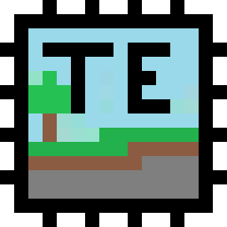

# Tellurium



**Faster chunk generation for Minecraft that gives you the same world.** Tellurium moves terrain and
surface generation onto the graphics card (Vulkan, any vendor), runs the remaining steps across all
processor cores, and saves chunks in the background.

On the reference system (24 threads, RTX 5070 Ti) a vanilla server generates and saves about 124 chunks a
second; with Tellurium the same server does 2,620 to 2,860.

> **Alpha.** This is `0.2.0-alpha.1`. It has been run on one machine (Windows 11, RTX 5070 Ti). Linux and
> other graphics cards are untested. Back up worlds you care about, and please report what you find on the
> [issue tracker](https://github.com/Miningmanias/Tellurium/issues).

## What it does

- **Terrain and surface on the GPU** for world generators on the tested list: vanilla Overworld, Nether
  and End, Terralith, Tectonic, Terralith with Tectonic, and Incendium; terrain for Amplified Nether and
  Nullscape. Any other generator, and any chunk the GPU flags as unsafe, is built by vanilla code.
- **Structures, caves and features in parallel**, with cheaper but equivalent versions of the hottest
  vanilla loops.
- **Background saving**: chunks are encoded and compressed off the server thread.
- **A pregenerator**: `/tellurium pregen start <radius>`, with pause, resume and stop. It continues
  after a restart.
- **Distant terrain**: chunks for Distant Horizons and Voxy come from Tellurium, paced so the game stays
  smooth.

## Downloads

| Minecraft | Loader | File |
| --- | --- | --- |
| 1.21.1 | NeoForge 21.1.176+ | `tellurium-neoforge-1.21.1-0.2.0-alpha.1.jar` |
| 1.21.1 | Fabric (loader 0.16+, Fabric API) | `tellurium-fabric-1.21.1-0.2.0-alpha.1.jar` |
| 1.21.11 | NeoForge 21.11.45+ | `tellurium-neoforge-1.21.11-0.2.0-alpha.1.jar` |
| 1.21.11 | Fabric (Fabric API) | `tellurium-fabric-1.21.11-0.2.0-alpha.1.jar` |

Minecraft 1.21.1 is the best-tested version: everything on this page was measured there. On 1.21.11 the
tested list holds vanilla, Terralith, Tectonic and the two together, and Distant Horizons and Voxy have
not been run. Builds for 1.21.4 (Fabric) and 1.21.8 (Fabric, NeoForge) can be made from source; see
[what was tested on which version](docs/evidence/minecraft-versions.md).

## Requirements

- Java 21.
- For the GPU part, a graphics card with Vulkan 1.2 and 64-bit float support (GeForce GTX 10 series and
  newer and Radeon RX 400 series and newer should qualify). Without one the mod says why in the log and
  keeps the processor-side improvements.
- On a multiplayer server **only the server needs the mod**. For singleplayer, install it in the client.
- Recommended: [ScalableLux](https://modrinth.com/mod/scalablelux). Lighting is not part of this mod, and
  every speed figure here was measured with it installed.

## Getting started

1. Put the jar in `mods/`.
2. Start the server or open a world and run `/tellurium status`. It names the graphics card, says what
   each dimension is generated with (and why, if that is vanilla code), and lists anything worth changing.
   In singleplayer the world's owner can use the commands without cheats.
3. To build a world ahead of time, stand where the centre should be and run
   `/tellurium pregen start 200` (a radius in chunks) or `/tellurium pregen start worldborder`.

| Command | What it does |
| --- | --- |
| `/tellurium status` | What is active, chunk counts, tips |
| `/tellurium pregen start <radius>` | Generate a square, `radius` chunks in each direction from where you stand (from the console: the world spawn) |
| `/tellurium pregen start <radius> <x> <z>` | The same, centred on block coordinates |
| `/tellurium pregen start worldborder` | Generate everything inside the world border |
| `/tellurium pregen pause` / `resume` / `stop` / `status` | `resume` also continues a job that a restart interrupted |

For another dimension, or from the console:
`/execute in minecraft:the_nether run tellurium pregen start 100`.

## Settings

`config/tellurium.toml` is written on first start:

```toml
enabled = true            # false: behave exactly as without the mod

[gpu]
mode = "auto"             # "auto" | "check" | "force" (untested generators too) | "off"

[generation]
parallel_steps = true

[saving]
async = true
compression_level = 1     # 1 fastest (files ~12% larger) ... 6 = vanilla size ... 9

[pregen]
in_flight = 1024
progress_seconds = 10
```

Every option, including those for Distant Horizons and Voxy: [docs/CONFIGURATION.md](docs/CONFIGURATION.md).

**A world generator that is not on the tested list** (a datapack, another terrain mod) generates with
vanilla code by default. To find out whether the GPU reproduces it, set `gpu.mode = "check"`, generate a
few thousand chunks across different biomes (`/tellurium pregen start 40`) and look at
`/tellurium status`: it counts the chunks compared with vanilla and the chunks that differ. Nothing the
GPU computes is kept in that mode, and it is slower than vanilla. With no differences,
`gpu.mode = "force"` turns the GPU on for that world. A check on the chunks you generated is evidence,
not proof, for the ones you did not.

## Speed

Chunks generated completely and saved, per second, after warm-up, on the reference system (24 logical
cores, RTX 5070 Ti, 16 GB heap, ScalableLux). "Vanilla" is the same server with every Tellurium switch
off.

| World generator | Vanilla | Tellurium |
| --- | --- | --- |
| Vanilla Overworld | 124 | 2,620 – 2,860 |
| Tectonic | 90 – 105 | 2,702 – 2,790 |
| Terralith | 41 – 48 | 1,750 – 1,810 |
| Terralith + Tectonic | 56 – 62 | 2,019 – 2,042 |

Against other chunk-generation mods on the same server with the same Chunky pregeneration: vanilla 127
chunks/s; C2ME 930 to 1,064; C2ME with its OpenCL module 2,020 to 2,140; Tellurium 2,960 to 3,479.
Method and caveats: [throughput](docs/evidence/throughput-fused-gpu.md),
[comparison with C2ME](docs/evidence/comparison-c2me.md).

What affects sustained pregeneration speed most:

- **Memory.** The pregenerator works on fewer chunks at a time on a small heap (one per 12 MB, so the
  default 1,024 needs about 12 GB); it says so when it does.
- **`sync-chunk-writes`** in `server.properties`. The default (`true`) is kept safe and costs a few
  percent.
- **Chunky** works too; Tellurium raises its built-in limit of 50 chunks at a time
  (`pregen.tune_chunky = false` leaves it alone).

## Distant Horizons and Voxy

- **Distant Horizons**: the chunks it generates to refine distant terrain come from Tellurium. A dedicated
  server built full-detail distant terrain about 4.6 times as fast as Distant Horizons alone (around
  2,100 chunks/s against 449). Those chunks are saved in the world, about 10 KB each.
  [Details](docs/evidence/comparison-distant-horizons.md).
- **Voxy** (on NeoForge through Roxy; singleplayer or the host of a LAN world): terrain within 128 chunks
  of each player is generated and handed to Voxy, 73,984 chunks in about 40 s on the reference system.
  [Details](docs/evidence/comparison-voxy.md).
- Far terrain is held back while the game needs the processor (a player flying, a late server tick, a
  long collector pause). What that does to stutter: [smoothness](docs/evidence/smoothness.md).

## What "the same world" means

- Through the surface step, every chunk compared is identical to vanilla (blocks, heightmaps, biomes,
  structure starts, post-processing marks): 8,281 chunks in each of 15 contexts on 1.21.1, among them
  three Overworld seeds, Nether, End, seven biome-specific areas, Terralith and Tectonic.
- From the features step on (ores, trees), vanilla itself does not produce identical chunks from run to
  run, so later steps are checked piece by piece: ore veins, biome lookups, and saved chunks against the
  chunks as generated after reopening the world.
- Other mods run alongside it: Biomes O' Plenty, Oh The Biomes We've Gone, Nature's Spirit, Geophilic,
  William Wythers' Overhauled Overworld, YUNG's structure mods, Regions Unexplored, Lithium, Chunky.
  [Compatibility](docs/COMPATIBILITY.md).

## Known limits of this alpha

- Tested on one machine. Not tested: Linux, other graphics cards, LAN play, a released (non-development)
  client on 1.21.11.
- Saved worlds are about 12% larger by default (faster compression); `compression_level = 6` gives
  vanilla-sized files.
- If the graphics driver resets, the mod says so once and generates on the processor until the next
  restart.
- Flying at very high speed in the first second of a session can stall for about a second.
- If something goes wrong: [troubleshooting](docs/TROUBLESHOOTING.md). `enabled = false` in the config
  turns everything off without removing the mod.

Tellurium was called WorldgenNext during development. Settings in `config/worldgennext.toml` are copied
to `config/tellurium.toml` the first time the renamed mod starts.

## More

- [All documentation](docs/README.md)
- [Changelog](CHANGELOG.md)
- [Building from source and contributing](docs/DEVELOPMENT.md)

## Licence

MIT. Dependencies keep their own terms; see [attribution](docs/ATTRIBUTION.md). No code from C2ME or its
OpenCL module, and no decompiled Minecraft source, is included.
