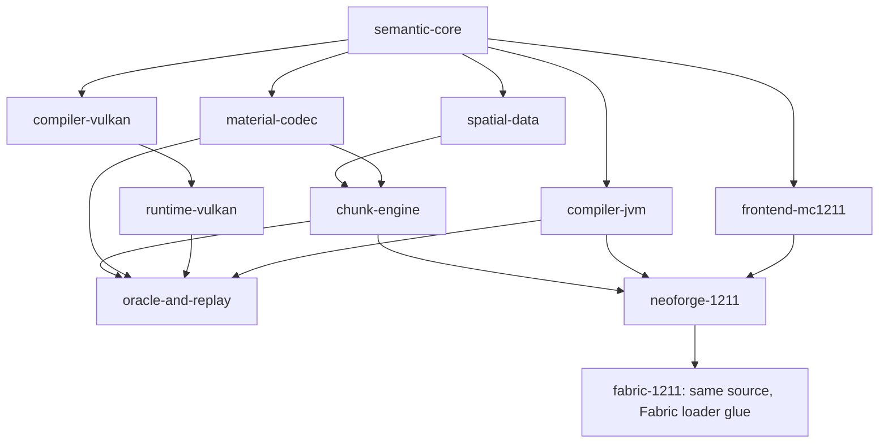

# v0.1 module architecture

This is the implemented foundation's dependency map; the complete long-term design is separate.

The next production architecture is specified in [V0.2-PLAN.md](V0.2-PLAN.md) and its [file/dependency map](v0.2/FILES.md), including the independent original-oracle artifact and one subordinate coordinator. It is not yet implemented.

Arrows mean dependency inputs, not claims that a live Minecraft generation pipeline is installed. The semantic subset has no noise stack, aquifers or ore generator yet. The NeoForge entrypoint is diagnostic and leaves generation to the original game.

## Boundaries

Pure modules never import Minecraft, NeoForge or LWJGL. The frontend lowers only immutable captured source snapshots and rejects unsupported operations; the mapped Minecraft reader and reflection boundary live in the NeoForge module. runtime-vulkan owns native Vulkan/Shaderc calls; CPU tests do not load it implicitly. Loader adapters isolate Minecraft types. The oracle application records synthetic fixture identity and actual comparison counts; only future same-stack oracle artifacts can claim Minecraft parity.

Representation correctness is independent from material-generation correctness. An exact roundtrip of section IDs does not prove those IDs are vanilla's output. A checksum validates encoded content, not terrain equivalence.

The engine package models byte reservations, cancellation, epochs and unique commits. It is not a C2ME fork, a production holder/ticket system or a features/lighting implementation.
