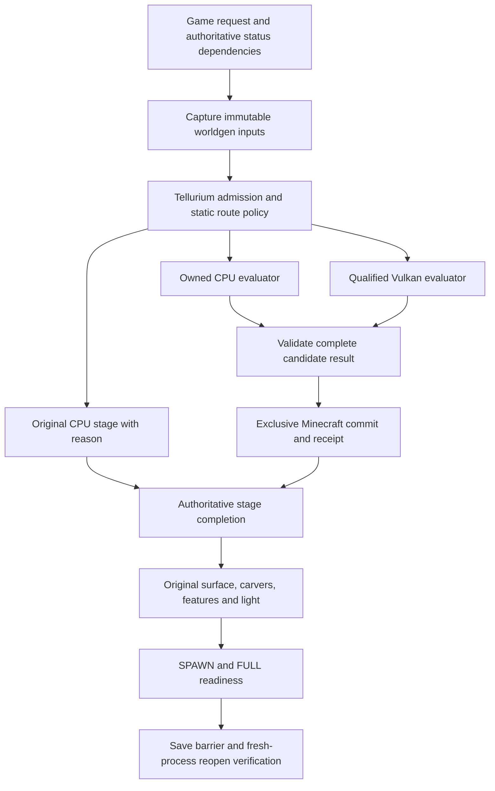

# Tellurium v0.2 — complete functionality before optimization

2026-10-01 continuation: inline reference dispatch removes the one-case CPU
FULL coordinator mismatch while retaining admission/validation/journal checks.
The new CPU FULL snapshot matches all ten independent original fields. GPU
FULL and GPU SAVED/fresh reopen also match all ten fields each on the same
frozen inputs for one vanilla core. This is isolated reference coverage,
not production threading or complete downstream qualification. See
[current verifier evidence](evidence/v0.2-live-gpu-verifier.md). Scope is unchanged.

Latest checkpoint (2026-09-30): the frozen Terralith replay stopped after 237
passing device/CPU receipts at `Long.MAX_VALUE (32,32)`, one water/stone state.
The corrected shared integer-floor helper now passes the full failing chunk
against all ten independent fields, plus 20,208 physical helper output checks.
327 focused tests/build/architecture checks pass, and the isolated GPU logical
verifier is packaged. A separate 500,000-request coordinator MODEL campaign
passes with tracked resources drained. Full GPU/live/FULL/SAVED/numeric/
installed-product/lifecycle/stability/baseline qualification remains open;
mandatory scope below is unchanged. See [aquifer correction](evidence/v0.2-aquifer-integer-floor.md),
[model campaign](evidence/v0.2-coordinator-model-campaign.md) and
[logical verifier](evidence/v0.2-live-gpu-verifier.md). Older checkpoint notes
below are retained history and do not override this current status.

Nonempty structure/ore continuation (2026-09-30): shared kernel metadata and
bounded ore input/division stages now reproduce the Terralith `Long.MIN_VALUE`
`(30,30)` counterexample: 98,304 states and ten independent fields, zero
differences. That checkpoint's complete 50-case extreme-seed subset now matches
4,915,200 states and 500 fields after bounded recovery. The newer host-copy/
fingerprint checkpoint passes 330 focused tests and four actual chunk controls;
no full-corpus/live/TPS gate is promoted. See
[retained failures and passing witness](evidence/v0.2-beardifier-gpu.md).

Bounded blended reduction (2026-09-30): the combined-mod native-compilation
timeout is superseded by a passing seed-0 negative/positive pair on the new
frozen jar: 196,608 states, 20 independent fields, zero differences. Primitive
controls add 600 final and 1,200 intermediate checks. Full-corpus, live, numeric
and downstream gates remain open; see [evidence](evidence/v0.2-shared-blended-reduction.md).

Captured beardifier continuation (2026-09-30): 896 exact physical primitive
comparisons pass with inline helpers. The previously rejected Terralith graph
marker now emits, and its seed-0 negative/positive full-chunk pair matches
196,608 states and 20 independent fields, zero differences. Combined-mod and
nonempty-structure coverage remain open. This does not change mandatory scope
or promote any live/TPS/release gate; see [evidence](evidence/v0.2-beardifier-gpu.md).

2026-09-30 continuation: the corrected shared End outer-island pair passes
131,072 storage states and 20 independent fields. Java signed remainders and
Vulkan compute/stage flag binding are fixed; compilation phase counters now
identify cold pipeline costs. Both GPU emitters support Tectonic's one-knot
splines. The graph-independent exact divider now passes Tectonic's first full
seed-0 `(32,32)` GPU witness (98,304 states, ten independent fields), and 7,540
primitive device comparisons; the full modded matrix remains open.
The bounded-cache artifact additionally passes the Tectonic negative/positive
pair (196,608 states, 20 independent fields, zero differences), with one new
shaderc compilation on the second case. These are isolated reuse observations
and do not replace the six-context GPU corpus, numeric, live, FULL/SAVED or lifecycle
requirements. See [evidence](evidence/v0.2-shared-end-metadata.md).

Exact GPU checkpoint (2026-09-29): seeds -1, 0 and 1 Overworld `(32,32)`
now pass all 98,304 states and all ten independent Minecraft oracle fields
under `GPU_IEEE_BITS`, including partial batches. Generic root staging replaces
the divergent exact-only split reconstruction. These are exact one-case
witnesses, not the complete G6 corpus, live TPS or release qualification.
Seed-0 Nether and End `(32,32)` also pass 65,536 storage states and ten
independent fields each. A far End island root matches bit-for-bit using
GPU neighbor/reduction kernels. The live backend no longer duplicates full
CPU terrain generation, while replay retains that comparison.
The executor additionally reuses bounded, fence-completed buffers and command
objects, avoiding per-dispatch native allocation churn. Current full exact
checks remain state-identical in all three dimensions with partial tails;
Overworld performs 10 buffer allocations over 1,388 dispatches. Live TPS and
the complete qualification gates remain open.
See [exact evidence and remaining cleanup](evidence/v0.2-gpu-exact-overworld.md).

2026-09-30 prototype continuation: immutable resident metadata suffixes,
bounded intermediate exports and a shared raw/chain resource pool are now
implemented. The half-chain Overworld witness preserves all 98,304 states and
ten independent fields while removing per-slice allocation churn (411 -> 12
buffers). Residency remains opt-in; the same-size host control is still faster.
Explicit wider batches up to 16,384 rows retain native-budget/fence bounds;
the standalone default remains 4,096. These observations do not close the
complete GPU corpus, lifecycle, FULL/SAVED or live TPS gates below.

Latest checkpoint (2026-09-29): seed-1 Overworld `(32,32)` now passes all
98,304 GPU-vs-CPU blocks and the independent original-only Minecraft
comparison (10 fields, zero differences). Source marker identities and spline
coordinate staging were corrected; shared coordinate/spline DAGs reduce
duplicated work. These are `GPU_NATIVE_DRAFT` NOISE witnesses, not G6, live TPS,
or release qualification. The reusable spline kernel passes the same oracle;
bounded parser caches reduce one full replay from 2m37s to 2m09s. Seed-0 also
passes all 98,304 states and ten independent fields with a 4,095-element
partial-tail batch; live TPS has not been measured.
Shared-table suffix upload and linear host result packing pass both seeds
again in 40–41s fresh Gradle processes, with about 91% less input upload.
These prototype timings are not matched performance or live TPS evidence.
Seed `-1` also passes all 98,304 states and ten independent fields after a
native-draft FP64 comparison correction, including partial batches. This
still does not establish general-seed or live GPU generation qualification.
See [the witness and open gates](evidence/v0.2-gpu-seed1-fix.md).

Status: **IN PROGRESS**. Updated 2026-09-22. The runnable code is a 0.2.0 correctness-first checkpoint; the required real Minecraft/GPU/FULL/SAVED gates remain open. The direct Overworld density branch now has targeted exact GPU diagnostics, while ordinary material output and qualified live generation remain open. The ordinary draft now has native coordinate preparation, a bounded host-staged exact Perlin path with an opt-in device-resident chain, an opt-in FP64 divider chain, and a device-side Beardifier/material-row prototype, but it has no full Overworld artifact or qualification receipt. A corrected one-point run completed all 40 fixed-call samples and device fan-in with exact CPU agreement (`staged=-0.2805788967238936`), but the compact same-stack oracle still returned `1.0`, so no qualification receipt was produced. The earlier dynamic shared-Perlin carrier crossed the full stage envelope but failed density parity; a later static captured-Perlin experiment exceeded the target driver's compiler envelope and was kept opt-in. The correctness-first default is host-staged GPU Perlin again. The Nether one-branch density shape now has both the original host-mediated exact receipt and a new opt-in resident material-row exact receipt (`65,536/65,536`, `0` mismatches); this is one context only and does not close the Overworld or release gates. The separate opt-in resident-density scratch route reached Overworld stage 3 but failed `11,634/65,536` on exact Nether replay, and the latest exact Overworld resident-material attempts remain diagnostic without an artifact. The opt-in CPU-live prototype now reaches normal NeoForge readiness and emits 121 live NOISE artifacts plus receipt/commit sidecars in a fresh 8-worker run, proving draft hook/coordinator/downstream wiring without claiming G9 parity. The CPU candidate NOISE corpus now covers all 1,500 required vanilla and pinned terrain-mod cases with zero mismatches; this closes the CPU corpus evidence slice only.

Latest GPU prototype checkpoint: the bounded host-staged route reproduces the recorded Overworld normal-noise probe value `-0.0886325403364702` at `(512,-56,512)` through real GPU dispatches, stopping before material output by design. Embedded normal-noise parents now have a real GPU containment path: a one-element first-branch replay reached stage 43 and returned `0.25578899322829773` at `(512,-64,512)` before the intentional diagnostic stop. The native-draft profile now groups four Perlin octaves per reusable staged module and four captured blended-noise calls per static group; bounded group probes reached their real GPU workers and stopped at intentional diagnostic boundaries. The embedded-root smoke returned the finite `0.10744060995659291` value. The Vulkan executor keeps a separate bounded cache for reusable Perlin/combine pipelines across ordinary stage reclamation. A correctly forwarded full host-staged native-draft replay used those group-four defaults but remained in the native compiler/device envelope and was stopped without parity output. The earlier shared metadata-backed full route crossed all 410 planned Overworld density stages and reached the material-input boundary, but split carriers diverged from the CPU with 61,158/98,304 density mismatches (17,071 sign mismatches); no artifact or receipt exists. The post-review host-staged full retries, including the grouped/cache path, remained in the native compiler envelope and were cleanly stopped without parity output. The host-staged route is therefore the default containment path, and the GPU/live/FULL/SAVED gates remain open.

This plan supersedes the earlier split of functional work across v0.2–v0.5. The target v0.2 release delivers a usable, exact chunk-generation mod and the machinery needed to verify it. The current checkpoint implements the shared immutable contracts, CPU primitives, registry-aware result ABI, oracle comparator, persistent-runtime lifecycle model, configuration and focused verification tasks. P01 additionally has an independent original-only NeoForge capture process and a 10-case original-vs-original NOISE preflight; P02 now has a live bound 1.21.1 15-root capture/direct-density smoke across vanilla Overworld, Nether and End; P04 now has an opt-in candidate CPU corpus across the three vanilla dimensions plus Terralith/Lithostitched, Tectonic/Lithostitched and the combined fixture, totaling 1,500 cases and 15,000 fields with zero mismatches. Qualification admission now supports a deterministic schema-2 bundle of exact context keys, and large density staging compiles one stage at a time while releasing consumed intermediates. The real GPU route, live commit and downstream release evidence remain open; the target driver currently requires host-staged normal-noise containment for continued GPU diagnostics. These checks do not relabel any contract as qualified GPU or live Minecraft generation. v0.3 begins performance optimization only after the frozen v0.2 baseline. No CUDA dependency or CUDA-backed abstraction is permitted.

Latest GPU containment update (2026-09-22): native-draft interpolation children
now use the wider stage envelope by default. The captured `wg_node_5` child
fell from `2,204` planned stages to `394` over `1,225` corners and completed
real GPU stages in a bounded replay, but the full route still stopped in the
normal-noise compiler envelope without an artifact or receipt. An opt-in paired
normal-noise module was also rejected on the current driver after entering a
larger compile envelope; it remains disabled. These changes improve prototype
containment only and do not close G6/G7/G9/G10/G12.

The latest fallback isolation probe added an opt-in staged-root diagnostic for
`wg_node_2150`. A one-point exact-island run still spent about 15 minutes in
dependency-stage compilation/compaction and was stopped before the selected
root, with no value or artifact. The staged path is retained as a diagnostic,
while a semantic subgraph extractor and bounded compile budget remain cleanup
work; no GPU qualification gate is promoted by this result.

The follow-up seeded-parent diagnostic supplied CPU child carriers only as
explicit test inputs and evaluated the `wg_node_2150` parent on Vulkan. The
GPU returned `0.03915412607761706`, matching the CPU parent value exactly.
This isolates the threshold/max parent from the unresolved child-subgraph
drift, but it is not GPU density parity or qualification evidence.

The diagnostic is now selected by a compiler-owned semantic fingerprint rather
than a transient generated function number. For the fallback parent at
`(512,-56,512)`, selector
`semantic:e0023b082cc7c7b494ebf6f62a0df74f9cdfcbdb17f7c219c935382ff55cb060`
resolved correctly in a fresh real-GPU capture; CPU-seeded children and the
CPU semantic-root value both matched the Vulkan parent at
`0.03915412607761706`. This makes the isolation probe reproducible across
captures, while remaining diagnostic-only because its child carriers are CPU
inputs and the full GPU density/material route still fails parity.

The next opt-in recursive GPU-child route now has its own 4,096-stage limit,
per-stage pipeline reclaim, and no large-capture compaction cache. A fresh
one-point probe of the unresolved `30e1…` semantic child still reached about
7.1 GiB resident before the first child completed and was stopped without a
value. This is compiler/graph-envelope evidence only; subgraph extraction is
required before another large recursive probe, and the ordinary planner cap
must remain unchanged.

The diagnostic also exposes an unqualified native-leaf escape hatch for the
recursive route (`debugDensityStageRootGpuChildrenNativeNoise=true`) so a
prototype can explore the GPU path without expanding the exact integer helper
closure for every captured normal-noise leaf. It is not a parity mode.

A native-leaf retry held about 3.3–3.4 GiB resident for roughly nine minutes
without a completed stage or value before being stopped. It improves the
compiler envelope but does not provide GPU parity or a qualification result.

The next containment slice now retains compiler-owned `ProgramNode` metadata
and can emit a minimal exact parent shader whose direct children are raw
FP64-carrier inputs. Pure arithmetic/select/range/marker/noise-wrapper parents
use this route; interpolation and structure-dependent parents fall back to
their existing domain-specific emitters, while spline knot trees rebuild their
coordinate nodes from carriers. A matching captured `Shift` leaf can also be
emitted as an isolated semantic shader under
`debugDensityStageRootGpuChildrenSemanticLeaves=true`; captured `Noise` leaves
reuse the existing two-half exact Perlin containment path after a standalone
semantic Noise probe returned an incorrect zero on the target driver. Java
compilation passed,
and the carrier shader reached real Shaderc/Vulkan compilation in a fresh
one-point Overworld probe. The recursive exact closure still entered the
driver compiler envelope at about 5.3 GiB resident / 6.8 GiB private before a
completed stage. The standalone semantic-leaf probe did compile and dispatch
a captured `minecraft:cave_layer` Noise node, but returned `0.0` against the
CPU semantic value `-0.02575933967591109`; captured Noise therefore remains on
the existing two-half exact Perlin containment route. These are
containment results only; no GPU parity, artifact, receipt or qualification
gate is promoted. The semantic carrier and leaf switches remain diagnostic
and the ordinary planner cap is unchanged. Captured Noise leaves now use the
existing two-half exact Perlin containment path after a fresh one-point probe
returned `-0.02575933967591109`, matching the CPU semantic leaf. Embedded
normal-noise parents also use staged coordinate/Perlin/combine modules; the
same-parent retry advanced into those modules but still reached about 5.5 GiB
resident in the driver compiler before a selected-root value. No GPU parity,
artifact, receipt or qualification gate is promoted.

The metadata-driven shared-Perlin prototype then made the recursive route
progressive: one cached generic sampler replaced per-leaf captured shader
compilation. The recursive route reached `wg_node_343` before its 180-second
budget and `wg_node_1321` before a 1,024-stage ceiling, with no artifact or
value. The ordinary planner, raised to a diagnostic-only 4,096-stage ceiling,
reached the stable semantic selector's `wg_node_2150` root in 11m31s, but its
GPU value `0.045047703014439194` disagreed with both the CPU full value
`0.029168161157509254` and the CPU semantic-root value
`0.03915412607761706`. It failed closed without an artifact. The follow-up
generic ABI now carries the complete captured `noise_sample` controls
(`yScale`, `yMax` and `smear`) in addition to factors, offsets and permutation
words; Java compilation passed, but this correction still has no focused GPU
parity result. The first rerun found the captured scalar form `uvec2(0u)` and
the parser now applies GLSL scalar replication; the next fresh probe reached
the 34,475-character generic sampler and entered the driver compiler at about
4.8 GiB resident before being stopped without a value. The route remains
diagnostic-only and all GPU/FULL/SAVED/live gates remain open.
The explicit unrolled fallback reached a comparable 34,800-character sampler
and about 5.1 GiB before the same compiler envelope, so it is retained only as
a selectable experiment rather than a claimed GPU solution.

Supporting documents: [file and API plan](v0.2/FILES.md), [test matrix](v0.2/TESTS.md), [work packages](v0.2/WORK_PACKAGES.json), [acceptance manifest](../test-manifest/v0.2-acceptance.json). They describe the target and checkpoint state; their existence is not execution evidence.

## 1. What “everything” means

The release must install as one Tellurium NeoForge mod, generate real vanilla-compatible terrain using its own qualified CPU and GPU implementations, preserve the remaining game generation stages, handle failure and lifecycle events, and produce ordinary playable, saveable worlds. It must have a real independent Minecraft oracle, complete diagnostics and reproducible artifacts.

Initial scope is **Minecraft 1.21.1, NeoForge 21.1.176, Java 21, Windows x64 with the current RTX 5070 Ti**, plus CPU operation when GPU generation is unavailable or disabled. Linux build/test automation and native packaging are included; Linux GPU support is advertised only after that platform is exercised. NeoForge first follows the existing product scope. Fabric remains a later adapter milestone unless explicitly added; the pure core must stay ready for that adapter.

“Complete” describes the supported product, not a rewrite of every Minecraft subsystem or an assertion that every stage executes on the GPU. The GPU must perform real NOISE evaluation and material generation. Structures, surface building, carvers, features, lighting, spawning and saving may use the original game implementations through correctly integrated adapters. Those are legitimate planned CPU stages, with explicit ownership and counters.

Required world configurations: vanilla Overworld, Nether and End; Terralith with its pinned Lithostitched loader fixture; Tectonic with Lithostitched; and the Terralith/Tectonic/Lithostitched combination, with exact compatible artifacts pinned before implementation. Required matrix entries cannot be quietly downgraded to unsupported CPU-only contexts and still count as a complete GPU release. Arbitrary unknown generators or custom density functions may use the original whole-stage CPU path with an explicit reason.

### Functional implementation versus optimization

| Required in v0.2 | Conservative implementation | Deferred to v0.3 or later |
| --- | --- | --- |
| Complete semantic frontend and CPU evaluator | Typed program, ordered operations, ordinary Java execution | Bytecode JIT specialization, SIMD, algebraic rewrites |
| Real exact Vulkan generation | Integer-based IEEE helpers where native arithmetic is unqualified; complete dense material output | Native arithmetic substitution, precision filters, workgroup/fusion searches |
| Resource ownership and asynchronous completion | Persistent device, fixed-capacity pools, disjoint buffer ranges, explicit copies | Scratch aliasing, zero-copy chunk application, lock-free allocators |
| Real spatial producers and consumers | Demand-driven exact samples; bounded resident data; reference uncached route | Speculative prefetch, large regional retention, locality tuning |
| Uniform/palette/dense output representations | Classify every block first, then encode the proven final states | Skipping material evaluation through interval/uniformity proofs, GPU palette reducers |
| Request coordination, routing and batching | One coordinator, bounded FIFO with ageing, fixed policies, batch 1 reference and small fixed batch variants | Learned placement, throughput/latency autotuning, new holder scheduler lineage |
| FULL and saved-world completion | Original stage machinery and storage format; explicit completion barriers | Alternative lighting engines, parallel feature rewrites, custom region I/O |
| Profiling and benchmark runner | Collect baseline time, bytes, counts and failures | Chasing throughput targets or choosing defaults by benchmark sweeps |

Correct synchronization, laziness, bounded work, partial-batch progress and complete metadata are functional requirements. They are not postponed merely because they also affect speed. Conversely, an optional experiment in the old proposal is not automatically a v0.2 prerequisite: OpenCL, Metal/D3D backends, LOD terrain, energy optimization and automatic variant search remain outside this milestone.

## 2. Starting point and changes to the v0.1 contracts

The [v0.1 evidence](evidence/v0.1-validation.md) records 107 passing CPU tests, 1,048 CPU synthetic comparisons, 917 normal-range GPU comparisons and 2 diagnostic GameTests. It records a failed strict native-FP64 capability check. These remain regression evidence; none proves real Minecraft generation.

| Existing component | v0.2 treatment |
| --- | --- |
| `DensityExpression`, `ReferenceInterpreter`, synthetic compilers | Preserve as a small, stable regression language. Introduce a distinct typed `WorldgenProgram`; do not silently change the synthetic finite-value and coordinate-rejection contracts. |
| `MinecraftDensityLowerer.lower(identity, Object)` | Replace the production seam with typed loader-captured snapshots. Minecraft reflection/types remain inside the loader module. |
| `WorldgenIdentity` | Expand production identity to include registries, settings, datapacks/mods, dynamic inputs, compiler/ABI versions, world epoch and device generation. |
| Fixture state IDs and section codec | Keep fixture tests. Add a registry-specific state table and whole-chunk result contract; never assume Minecraft air is numeric ID 0. |
| `EpochTaskEngine` | Keep as a model. Add real subscriptions, backend-issued execution receipts, finite terminal-record retention and actual Minecraft commits. |
| `SharedTileCache` / `ByteBudget` | Keep model tests. Add typed samples, Y/domain/dynamic identities and accounting for staging, copies and retained capacities. |
| `VulkanSmokeRunner` | Keep diagnostic CLI. Build a separate persistent production service; per-fixture device creation and process-exit quarantine are insufficient inside Minecraft. |
| `ReplayReport` | Keep synthetic schema. Add separate Minecraft corpus, comparison and endpoint schemas; no report changes scope by relabelling its samples. |
| Diagnostic NeoForge jar | Add runtime, config, lifecycle listeners and the minimal qualified generation hook. Rework native packaging and jar checks deliberately. |

The frozen v0.1 runtime archives and evidence remain unchanged. The implementation checkpoint in this document introduces version 0.2.0 with an explicit API/ABI migration; unresolved release gates remain fail-closed until their required evidence exists.

## 3. One authority for chunk state

Minecraft's version-pinned holder/ticket/status system remains the authority for chunk prerequisites, neighborhood access, status transitions and publication. Tellurium has **one subordinate coordinator** for its preparation, CPU/GPU execution, validation and application. It does not create a competing holder scheduler.

This revises the old proposal's early C2ME scheduler adaptation: a C2ME/FlowSched or Moonrise holder replacement is not required to make the baseline functional. Any later replacement must be selected as one lineage and requalify ownership and ordering. v0.2 must not stack multiple chunk-system rewrites.

The full 1.21.1 order is `EMPTY → STRUCTURE_STARTS → STRUCTURE_REFERENCES → BIOMES → NOISE → SURFACE → CARVERS → FEATURES → INITIALIZE_LIGHT → LIGHT → SPAWN → FULL`. Derive dependencies and neighborhood requirements from the pinned game implementation, not this abbreviated linear display. **SAVED is a verification endpoint, not a Minecraft `ChunkStatus`.**

| Stage | v0.2 execution owner | Integration requirement |
| --- | --- | --- |
| Structures and references | Original game/mod stack on its valid executor | Preserve seeds, starts, references and neighborhood reads; capture the dynamic inputs NOISE needs. |
| BIOMES | Original same-stack biome population | Capture biome state and router inputs for comparison; preserve climate quantization and biome search ties. GPU biome population is optional later work. |
| NOISE | Owned CPU or real Vulkan evaluator for supported contexts | Evaluate all relevant router/material work and commit exact complete results. Original CPU route handles explicitly unsupported contexts. |
| SURFACE | Original `SurfaceSystem` and same-stack hooks | Preserve biome-dependent rules and special badlands/frozen-ocean behavior; retain any required NoiseChunk lifecycle state. |
| CARVERS / FEATURES | Original ordered neighborhood machinery | Preserve cross-chunk writes, RNG order, structures, postprocessing, ticks and block entities. |
| INITIALIZE_LIGHT / LIGHT | Original light engine | Wait for actual light completion; record light arrays and light-correct state. |
| SPAWN / FULL | Original status/conversion machinery | Preserve worldgen spawning, publication and ProtoChunk-to-LevelChunk semantics. |
| SAVE / REOPEN | Original serializer/region I/O, wrapped by a bounded verifier | Wait for the declared barrier, close the process, reopen and compare logical state. |

## 4. Exact numerical execution is an early milestone

The current RTX driver advertises no FP64 subnormal preservation. Removing that check, adding `precise`, or passing more normal-range samples does not qualify arbitrary Minecraft arithmetic. Native division, square root and library operations also need their own accuracy contract. Vulkan capabilities and emitted execution modes must agree. [Vulkan floating-point controls](https://docs.vulkan.org/refpages/latest/refpages/source/VkPhysicalDeviceFloatControlsProperties.html), [SPIR-V environment](https://docs.vulkan.org/spec/latest/appendices/spirvenv.html).

The conservative v0.2 GPU baseline is **`GPU_IEEE_BITS`**: represent FP32/FP64 values as integer bits and implement the exact arithmetic needed by the admitted worldgen program using integer shader operations. This is correctness machinery, not a speed improvement. Native operations stay disabled in this profile unless their full contract is established; an all-integer implementation avoids depending on unavailable native subnormal behavior. Use 32-bit limbs as the portable baseline, or an explicitly qualified integer-capability variant. Never hide a native floating operation in a supposedly software-exact helper.

Implement the actual operator closure, not a general math library: add/subtract/multiply/divide/square root where reached; comparisons; min/max and clamp semantics; conversions among FP32, FP64 and Java integers; floor/truncation; signed zero; infinities/NaNs; wrapping integer/RNG operations. Preserve each Java FP32 rounding point. Immutable seed-derived tables may be captured on the CPU, but precomputing the complete density/material output on the CPU is not GPU execution.

The CPU contract follows the pinned game and Java 21, including evaluation order, overflow and conversion behavior. Raw-bit comparison is required for finite values and signed zero. NaN payloads are not assumed portable across Java arithmetic; specify equivalent NaN classification, comparisons and downstream behavior, and retain original CPU execution for unsupported observable bit semantics. Final blocks and metadata still require exact equality. [Java expression semantics](https://docs.oracle.com/javase/specs/jls/se21/html/jls-15.html#jls-15.4), [Java Math contracts](https://docs.oracle.com/en/java/javase/21/docs/api/java.base/java/lang/Math.html).

Berkeley SoftFloat 3e and TestFloat are candidates for licensed algorithms and a second arithmetic oracle. Pin and audit exact files before reuse; a translation to shader code must pass independent conformance tests. They are not drop-in GLSL libraries or an automatic proof of Minecraft compatibility. [SoftFloat](https://www.jhauser.us/arithmetic/SoftFloat.html), [upstream license](https://github.com/ucb-bar/berkeley-softfloat-3/blob/master/COPYING.txt).

Required numerical gate: compiled SPIR-V inspection, adversarial primitive vectors, actual-device comparisons and real Minecraft router/material replay. If the exact GPU route fails this gate, v0.2 remains incomplete as a GPU mod. A correct CPU-only build may be an interim checkpoint, not the final release.

## 5. Production data contracts

| Contract | Required content and ownership |
| --- | --- |
| `WorldgenSnapshot` | Seed, dimension, complete settings, all 15 router roots, noise/RNG parameters, registry state table, biome configuration, generator flags, structure/blending dependencies and source-stack fingerprint. Immutable and loader-free. |
| `WorldgenProgram` | Typed FP32/FP64/integer/boolean values, ordered control regions, marker/cache domains, interpolation geometry, material decisions and explicit RNG effects. No loader objects or mutable game cache references. |
| `ContextIdentity` | Hashes/versions of snapshot, registries, datapacks/mods, program, numeric profile, ABI/compiler; world epoch and relevant dynamic-input identity. Device-generation identity is separate from world identity. |
| `GenerationRequest` | Logical work key, endpoint/stage, chunk coordinates, authoritative dependency/ownership token, priority class and subscribers. A cancelled subscriber does not automatically cancel shared work. |
| `ResourceReservation` | Atomic budget bundle for snapshots, host staging, CPU output, GPU buffers, readback, application and save backlog. Capacity and object-overhead estimates are distinguished from measured bytes. |
| `ChunkNoiseResult` | Versioned header; full storage/generation geometry; final material states; per-section metadata; postprocessing/fluid marks; required heightmaps; context/request identity; exact registry mapping. Include prerequisite biome state for validation without overwriting it blindly. |
| `ExecutionReceipt` | Runtime-issued submission/completion identity, numeric profile, shader/program hashes, actual result counts and component ownership. Caller-labelled GPU enums are insufficient. |
| `CommitToken` / `CommitReceipt` | Expected holder/status/revision/context/epoch; one winning mutation and final publication. A late result cannot resurrect an expired target. |
| `ComparisonCoverage` | Exact expected fixture/chunk/field sets, actual compared sets, differences and exclusions. Missing or duplicated coverage fails; checksums alone do not pass parity. |
| `SavedChunkReceipt` | Requested endpoint, save completion policy, process-close barrier and reopened logical-state comparison. No claim of physical durability from an OS write enqueue. |

All binary sizes, products, offsets, alignment and ranges use checked arithmetic before allocation or dispatch. Numeric/ABI/profile versions are part of every reusable result and pipeline identity. Serialized fixtures use canonical block-state names/properties plus registry fingerprints; process-local integer IDs cannot be compared as global identities.

## 6. Implementation work packages

Each package ends with a reviewable artifact and a passing gate. Estimates are rough engineering effort, not delivery promises; arithmetic and Minecraft lifecycle integration have the greatest uncertainty. Work can proceed in parallel only after shared contracts are pinned.

| ID | Deliverable | Prerequisites | Exit gate | Effort |
| --- | --- | --- | --- | --- |
| P00 | Freeze baseline, dependency/corpus identities, module boundaries and license inventory | None | G0: reproducible inputs and traceable plan | 2–3 days |
| P01 | Independent Minecraft oracle, snapshot comparator and failure artifacts | P00 | G1: original-vs-original and injected-mismatch checks | 6–10 days |
| P02 | Complete typed frontend, state/context model and CPU semantic evaluators | P00, P01 contracts | G2: real primitive/root/marker parity | 7–12 days |
| P03 | Exact GPU arithmetic and binary ABI foundation | P00, P02 numeric spec | G3: real-device integer-IEEE conformance | 10–20 days |
| P04 | Complete CPU dense NOISE/material generator | P01, P02 | G4: CPU candidate matches independent game NOISE | 6–10 days |
| P05 | Persistent Vulkan runtime and bounded resource lifecycle | P00, P03 ABI | G5: native visibility/lifetime/failure contracts | 6–10 days |
| P06 | Real dense GPU NOISE/material execution | P03, P04, P05 | G6: independent real-game GPU replay | 8–14 days |
| P07 | Registry-aware chunk results and all material representation paths | P02, P04 | G7: dense/uniform/palette plus complete metadata parity | 4–7 days |
| P08 | Production coordinator, subscriptions and real spatial producers | P02, P05, P07 contracts | G8: bounded progress, cancellation and accounting | 6–10 days |
| P09 | Live NOISE interception, commit and lifecycle integration | P04–P08 | G9: actual live CPU/GPU application and rollback | 7–12 days |
| P10 | FULL completion, original-stage bridges and saved-world verification | P09 | G10: FULL and reopened state parity | 6–10 days |
| P11 | Product config, compatibility policy, packaging and operator tools | P08, P09 contracts | G11: installed-jar and mode behavior | 3–5 days |
| P12 | Supported-matrix qualification, stability and baseline capture | P01–P11 | G12: every required release gate closed | 6–10 days |

The estimates sum to 77–133 engineer-days (roughly 80–135) before major surprises. Do not translate parallel agents directly into a calendar promise. P01/P02/P03 and the P06→P09→P10 qualification chain constrain useful parallelism.

### P00 — Freeze the contract

Retain the v0.1 archive/hash and regression artifacts. Pin Minecraft/NeoForge/JDK/LWJGL plus exact terrain-mod, datapack and transitive dependency hashes. Record both an original same-stack control and a candidate configuration. Complete an executable status/node inventory from pinned sources. Decide API/ABI versions, supported world bounds, block-state identity and default resource ceilings. Pin any SoftFloat/TestFloat material before copying it; preserve notices and keep excluded C2ME OpenCL/CUDA code out of the dependency graph.

### P01 — Build the independent oracle first

Create isolated original and candidate runs with the same seed/settings/stack, equivalent prerequisites and separate worlds/caches. The original process must not load Tellurium's compiler or mutation hook. Capture NOISE, FULL and reopened snapshots through game APIs. Prove the comparator detects single-block, biome, heightmap, postprocessing, tick/light and coverage mutations. Record input hashes and coordinates, not just human-readable case names. Validate original-vs-original determinism before attributing differences to the candidate.

### P02 — Finish the semantic frontend

Inventory all reachable density types and all 15 router roots. Implement constants, arithmetic/transforms, clamps/ranges, splines, noise samplers, shifted noise, legacy/blended noise, End-island behavior, gradients, blending and beardifier inputs, holder indirection and every NoiseChunk marker. Preserve cache evaluation domains and lazy branches; `FlatCache`, `CacheOnce`, `CacheAllInCell` and interpolators cannot simply be erased as aliases.

Implement seed expansion, legacy/Xoroshiro positional randomness, permutations/octaves, wrapping and fractional arithmetic exactly. Distinguish per-world constants, columns, lattice points, aquifer cells and block-local state. Custom nodes declare their full effects and a literal reference. Unknown operations return actionable capability decisions before GPU admission. Required matrix nodes need actual implementations, not a blanket original-CPU escape.

### P03 — Qualify the numerical route

Define a typed numeric specification from P02. Add portable integer IEEE helpers and generate conformance kernels that accept/return raw integer carriers. Compare against Java and an independently pinned arithmetic oracle. Cover boundary rounding, cancellation to subnormal, overflow, negative zero, casts, division/sqrt, NaN comparisons and integer overflow. Inspect SPIR-V for forbidden floating operations in the software profile. Split work into conservative bounded dispatches before testing large graphs.

### P04 — Generate complete CPU NOISE results

Build a scalar CPU worldgen interpreter and an independently executable prebound CPU program. Preserve explicit interpolation state/order, exact aquifer candidates/status/barrier decisions, fluid postprocessing, and the ore material rule including copper/iron/raw blocks/filler and RNG order. The material sequence is aquifer after final density/beardifier, optional ore rule, then the configured default block. Handle aquifers/ore disabled, dimension-specific geometry, sea levels and full storage height. Compare complete dense results against literal Minecraft before GPU terrain work can pass.

### P05 — Replace the smoke runtime with a production service

Use one persistent device/context and externally synchronized queue owner. Implement checked buffer layouts, bounded disjoint allocations, uploads, dispatch, output validation and asynchronous completion. Support correct coherent and non-coherent visibility or explicitly reject an unsupported memory path before admission. Keep scratch, upload, readback and application leases separate, even if the baseline retains each conservatively. Pipeline compilation is bounded and keyed by every semantic/ABI/device input; one small in-memory cache is sufficient.

Define running, draining, disabled and lost-device states. A timeout cannot free potentially active buffers. Stop admission, fail affected requests, invalidate the device generation and quarantine resources whose retirement is unproven. An in-process runtime needs a bounded shutdown policy; it cannot rely on the v0.1 CLI exiting after every failure.

### P06 — Generate real material output on the GPU

Emit the full admitted program and material logic using the qualified numerical profile. Upload immutable noise tables, registry descriptors and structure/blend snapshots. Start with one chunk and dense integer result IDs; use simple fixed stage boundaries and explicit intermediate arrays. Bounded slices and partial dispatch tails are required for driver responsiveness. All core final-density, aquifer and ore work attributed to `GPU_NOISE` must actually execute there; CPU-precomputed final answers cannot be counted as GPU generation.

Pass captured real-game replay for every required matrix context before enabling the live interception hook. Exercise multiple seeds, changed dynamic inputs and shuffled/partial batches. Keep the software-exact route as the reference GPU baseline. Native substitution, fusion, subgroup tricks and batch-size sweeps wait.

### P07 — Complete material transport and metadata

Introduce full chunk results and real state registry mapping. Compute every block first, then choose dense, uniform or palette representation from those final states. Preserve air/fluid semantics, all section counts, storage height, worldgen heightmaps and postprocessing. Test little-endian ABI versus host decoding explicitly. Validate the entire directory, lengths, counts, IDs and checksum before touching a chunk. Do not infer uniform stone from density or omit ore/fluid exceptions.

### P08 — Make the engine and spatial services real

Implement unique work keys with multiple request subscriptions, static route policies, bounded queues and an explicit resource bundle reservation. A cancelled consumer releases its interest without cancelling other consumers. Completed records retire during the same world epoch; long exploration cannot fill the v0.1 tombstone table permanently.

Wire real lattice/column/aquifer producers to real consumers. Keys include Y extent, domain, graph, world epoch, numeric semantics and dynamic dependencies. Provide an uncached reference mode. Shared producers must work with incomplete tiles; never create giant tickets to fill a batch. Initial batching uses 1 as reference and small fixed 2/4 variants for correctness. No worker blocks on tasks queued behind itself, and no task holds one scarce resource while waiting indefinitely for another.

### P09 — Intercept and commit real chunks

Enable the hook only for already qualified contexts. Capture input state under valid game ownership, release locks while computing, then validate identity/revision before acquiring exclusive commit ownership. Apply through a conservative complete journal, preserving sections, counts, heightmaps, postprocessing, dirty state and relevant NoiseChunk lifecycle assumptions. Complete the game future only after successful publication.

Inject failure at every mutation step. A failed rollback makes the target unsafe and fails the request; do not run original generation over partially written state. Reload, unload, cancellation and device-generation changes invalidate old work without freeing active native resources. Unsupported/populated/blended targets must either have a qualified path or select the original stage before mutation.

### P10 — Complete playable and saved chunks

Keep the original stages and mod hooks in their required ordering, including specialized surface behavior, cross-chunk features, light initialization, spawning and FULL conversion. Verify that GPU NOISE does not leave hidden cache/lifecycle assumptions that break a later CPU stage. Build distinct NOISE, FULL and SAVED endpoints. For saving, declare a logical flush/close policy, close the candidate server, reopen in a fresh process and compare logical state with the independently generated reference.

Do not require compressed region files to be byte-identical: define canonical logical comparison and document any permitted nondeterministic fields individually. A blanket exclusion of entities, ticks, structures or lighting is not an acceptable shortcut. First prove reference-vs-reference stability at the same paused/tick-controlled endpoint.

### P11 — Make it an installable product

Ship one NeoForge jar with the required core/runtime classes and a deliberate LWJGL/Vulkan/Shaderc native strategy. Audit Minecraft's existing LWJGL versions and avoid duplicate class/native loading; test a headless server as well as integrated play. Keep native loading lazy in CPU-only mode. Replace v0.1 packaging checks that currently forbid all runtime dependencies with precise expected dependency/namespace checks.

Provide `CPU_ONLY`, `GPU_REQUIRED` and `AUTO_SUPPORTED` modes, explicit resource limits, safe device selection, diagnostics and structured reports. AUTO uses supported exact routes under a fixed policy; it is not a learned cost estimator. Detect a second holder scheduler or incompatible worldgen hook and either use a documented compatible original route or report the conflict clearly. Generation must remain functional when shader compilation or GPU initialization is unavailable in AUTO/CPU mode.

### P12 — Qualify and freeze

Execute every required matrix fixture on the frozen source/jar/dependency snapshot. Run the failure/lifecycle and long-run campaigns, installed-jar bootstrap, integrated-play diagnostics and CPU-without-native tests. Collect stage timing, bytes, allocation high-water marks and baseline NOISE/FULL/SAVED rates without tuning parameters for a headline result. Archive raw comparisons, schemas, shaders, logs and hashes. Release 0.2.0 only when every mandatory gate has actual evidence; then open the v0.3 optimization backlog.

## 7. Failure, fallback and observability rules

Production states are `WAITING_DEPENDENCIES → READY → ADMITTED → EXECUTING → RESULT_READY → VALIDATING → COMMITTING → COMMITTED`, plus explicit rejected, cancelled, stale and failed terminals. Only the authoritative commit token can win publication. Recovery is a new attempt on the same logical work; it cannot erase the failed attempt.

Before admission, an unsupported capability may select `CPU_ORIGINAL_PLANNED`. After a GPU attempt fails, normal product mode may permit at most one exact `CPU_RECOVERY`, only on a verified unchanged or fully restored target. Strict oracle/GPU-required runs fail on any recovery, missing required capability or incomplete comparison. Save failure fails SAVED even if NOISE and FULL succeeded.

Track subscribers, unique work, backend attempts, native submissions, validated results and commits as separate identities. Coalescing means those counts are not interchangeable. Record at least: requested/rejected/cancelled/stale/failed work; CPU-owned/original/recovery execution; GPU submitted/completed/validated/committed; compared/mismatched fields; FULL completed; save barrier completed; reopened verified. At drain every admitted work item has exactly one terminal outcome and every live reservation is accounted for or explicitly quarantined.

No clean-checksum result, absent mismatch field, launched process, CPU fallback or normal-range synthetic comparison can satisfy the real GPU/Minecraft gate.

## 8. Definition of done

The detailed bounds and fixtures are in [TESTS.md](v0.2/TESTS.md) and the [acceptance manifest](../test-manifest/v0.2-acceptance.json). All of the following are mandatory for the initial Windows/NeoForge release:

1. Complete required node/material/context coverage, exact CPU results and a real qualified GPU route on the target GPU.
2. Exact NOISE, FULL and reopened logical state across the required world/terrain-mod matrix, with nonzero complete comparison coverage.
3. No unsupported mandatory case, fallback, silent failure, hard failure, stale commit or duplicate commit in strict successful runs.
4. Fault injection proves bounded terminal completion, correct rollback/recovery classification and no unsafe resource reuse.
5. Bounded coordinator/native/host/save resources; progress with worker count 1 and small legal budgets; successful busy shutdown and restart.
6. Installed-jar dedicated-server and integrated-play checks, CPU-only operation without Vulkan initialization, and complete license/native packaging checks.
7. Reproducible source/binary/configuration/corpus/shader identities and operator commands, with old v0.1 evidence retained.
8. Baseline performance recorded honestly. **No speedup or chunks/sec threshold is required for v0.2.** Test completion bounds prevent hangs; they are not optimization targets.

## 9. Main risks and stop conditions

| Risk | Early mitigation | Consequence if unresolved |
| --- | --- | --- |
| Integer IEEE helpers are incorrect or too complex | P03 primitive conformance and SPIR-V inspection before terrain shaders | GPU release stays incomplete; do not lower arithmetic guarantees |
| Vanilla semantics differ from the synthetic language | Separate typed IR; literal marker/RNG/material oracle | Reject affected contexts until implemented |
| Private game lifecycle state survives NOISE | Real FULL comparison and NoiseChunk state audit before default enablement | Keep hook disabled for affected lifecycle |
| Mod node/hook changes output or ordering | Pinned same-stack oracle and adapter capability registry | Required matrix entry blocks release; unknown external stack gets reported original route |
| Callback/subscriber/resource deadlock | Single-owner model, atomic reservation, single-worker/tiny-budget tests | No release with unexplained unfinished requests |
| Device loss or rollback leaves unsafe state | Generation IDs, explicit quarantine and full mutation journal | Fail request/device session, preserve evidence, never silently resume |
| Packaging works only in the development classpath | Installed-jar and headless/integrated smoke | Packaging gate remains open |
| The baseline is slower than the old mod | Accept correctness-first rates; capture costs without tuning | Expected v0.3 work, not permission to remove required functionality |

## 10. Sources and implementation handoff

The local review used `neoforge-1211/build/moddev/artifacts/neoforge-21.1.176-sources.jar`, SHA-256 `011621087f999bd15c0efab500fa75d16b6f80eba99f1fd509461f21852bc71a`, as read-only reference. Relevant classes include `ChunkStatus`, `ChunkStatusTasks`, `NoiseChunk`, `NoiseRouter`, `DensityFunctions`, `Aquifer`, `OreVeinifier`, `SurfaceSystem`, `Climate` and the chunk serializer. No decompiled source is added to this plan or project implementation.

The [NeoForge 1.21.1 GameTest documentation](https://docs.neoforged.net/docs/1.21.1/misc/gametest/) informs loader test setup; synthetic GameTests are not substituted for a non-flat original-world oracle. The earlier [design evidence](design/EVIDENCE.md) remains provenance for the optimization hypotheses, including its unavailable historical artifacts.

Start implementation with **P00 and P01**, while P02's type/operator inventory and P03's numeric specification proceed independently. Do not start a live generation hook before P04 and P06 can already prove the candidate's output in isolation.

## Current GPU implementation checkpoint — 2026-09-22

The native-draft Overworld prototype now executes the complete captured density
plan on the real RTX 5070 Ti: the widened interpolation child completed
`394/394` stages over `1,225` corners, followed by GPU aquifer, ore and final
material stages for `98,304` blocks. The bounded host-staged Perlin route uses
one-octave groups by default; device recreation between groups/halves remains
an opt-in compiler-envelope escape hatch.

The latest group-one run reached the independent density parity gate and failed
closed on `24,055/98,304` density values with `1,016` sign mismatches. The
first mismatch was `(512,-63,512)`: CPU `0.03644339979584914` versus GPU
`0.036553977141546776`. It produced a failure sidecar and complete stage trace
but no artifact or receipt. A bounded child-corner diagnostic narrowed the
drift to the `wg_node_2150` fallback subtree while `wg_node_2101` agreed at
the comparison probe. Therefore this is real GPU execution/containment
evidence, not G6 qualification; all context rows, FULL, SAVED, terrain-mod
and live gates remain open.

The targeted follow-up now identifies the interpolation boundary: native
`wg_node_4` returns `0.11428212498167178` versus the CPU value
`0.1139361094199007` at `(512,-63,512)`. Replacing only the parent lerp with
the exact carrier has no effect; the child/spline graph is the remaining
numeric divergence. A historical full exact-subtree experiment was stopped at
stage `84/444` during shader compilation. The implementation is now narrowed
to an opt-in exact-parent plus FP32-`uint`-stage isolation mode, but its
focused probe also ended without a diagnostic in the bounded compiler window.
An exact `wg_node_215*` island hit the same compiler boundary before producing
a result. `nativeDraftExactInterpolation` therefore remains experimental and
the native-draft path remains containment-only. A direct native `wg_node_5`
child probe at the same point was also stopped after roughly four minutes in
the driver/compiler path without a value, so no GPU parity claim is added.
Native-draft normal-noise staging now defaults to one-octave modules to reduce
the observed exact-carrier compile envelope; the setting remains an explicit
diagnostic control and does not claim parity.

A follow-up one-point carrier retry enabled device recreation every four
completed stages, capped the recursive route at `512` stages and `180` seconds.
It still remained inside repeated source compaction/driver compilation, grew
from roughly `5.6` to `5.9` GiB resident over about five minutes, and was
stopped without a selected-root value, sidecar, artifact, receipt or parity
result. The elapsed guard only runs between completed stages, so device
recreation was not reached for the compile that stalled; the setting remains a
diagnostic containment experiment rather than a GPU qualification mechanism.

A second retry additionally recreated the device between normal-noise halves
and after every completed recursive root. Resident memory oscillated between
roughly `4.0` and `5.3` GiB, but the embedded parent sequence still produced no
selected-root value after about five minutes and was stopped. The half-boundary
reset improves containment only; it does not close the Overworld GPU gate.

## Full native-draft candidate result — 2026-09-22

The next bounded native-draft run completed the full Overworld candidate route
on the RTX 5070 Ti for seed `0`, chunk `(32,32)`, including GPU density,
aquifer, ore and final material dispatches over `98,304` storage blocks. The
independent CPU state comparison failed closed at `62/98,304` blocks. The
largest reported pairs were `stone -> air` (`31`), `stone -> water` (`29`),
and `water -> stone` (`2`); the first mismatch was `(516,8,525)`.

The run is therefore a real GPU execution witness and a useful prototype
baseline, not G6 qualification. A focused probe showed that the first material
mismatch was an aquifer decision boundary: the CPU captured aquifer selected
water while the GPU aquifer stage returned the no-candidate/default-stone
carrier. The staged CPU graph oracle independently passed its full captured
root comparison after the signed FP64 helper correction, so this remaining
failure is isolated to the native-draft GPU/material path rather than being
reported as a CPU-oracle pass.

An opt-in hybrid that evaluated only the captured aquifer barrier leaf through
the exact normal-noise path was tested and rejected: it increased the full
run to `101/98,304` mismatches. Its source/runtime changes were reverted.
The strict Overworld GPU, FULL, SAVED, terrain-mod and live-provider gates
remain open, and live generation remains disabled.

The follow-up exact-aquifer-stage A/B was wired as an explicit opt-in
(`tellurium.gpuCandidate.exactAquiferStage=true`). A focused real-GPU
probe at `(516,8,525)` returned the expected aquifer carrier
`[1,80,0,0]` and final material `[80,0]`, fixing the original target-point
decision in isolation. The full seed-0 replay then increased the mismatch
count to `282/98,304` (`209` stone-to-water and `73` stone-to-air), because
the native density carrier remains unqualified at other aquifer thresholds.
The switch stays disabled by default and is retained only as a diagnostic
seam; it produces no artifact or receipt and does not close any release gate.

The follow-up pressure work reached a real GPU scalar decision at
`(512,-1,526)`: the captured pressure base decoded as `7.5` for CPU density
`-0.001301293401027703`. The temporary sign-preserving coarse carrier was an
intermediate diagnostic, not the current draft. The opt-in exact route now
uses integer similarity numerators and a four-limb rational comparison
against binary64 density, avoiding FP64 multiply/divide in the pressure
consumer. Barrier noise and complete threshold behavior remain unqualified;
the default native route retains its legacy FP64 pressure path.

Two fresh full exact-stage attempts were stopped before dispatch at the RTX
5070 Ti native compiler boundary after approximately eight minutes and six
minutes respectively. The compact retry still held roughly 3.7--4.1 GiB
resident. No artifact, receipt, or parity result was produced. The prior
completed exact A/B (`282/98,304`) and the best default baseline
(`62/98,304`) remain the governing evidence. Rational and native-closure full
retries stopped before dispatch in the target driver's multi-gigabyte compiler
envelope and produced no new artifact or parity result. The exact aquifer
consumer is therefore still an unqualified prototype seam, not a completed
V0.2 gate.

The implementation follow-up is intentionally contained behind
`exactAquiferStage=true`; `exactAquiferStageNative=true` is an additional
compiler-envelope experiment and both switches remain disabled by default.
The next required work is a compact independently compiled aquifer module
with barrier-noise contribution, threshold-by-threshold same-stack parity,
and structured compile-budget failure evidence before any receipt or live
provider admission.

The candidate also now enforces a `maxShaderSourceChars` fail-closed budget
before shaderc/Vulkan compilation (default `900000`; `-1` is reserved for a
bounded compiler experiment). A structured failure sidecar still needs to
replace the current exception/stage-log evidence before release.

The exact aquifer prototype now has a second explicit opt-in,
`tellurium.gpuCandidate.exactAquiferBarrierInput=true`. It evaluates the
captured `barrierNoise` root as a separate GPU carrier stage and supplies a
seven-word aquifer row, keeping the compact consumer's reachable source near
49 KB in a fresh RTX 5070 Ti probe at `(512,-1,526)`. The carrier-enabled stage
dispatched and returned `[0,0,1,0]`, consistent with the CPU no-fluid/air
decision. This is a real GPU ABI/dispatch witness only: the run stopped at the
scalar diagnostic boundary, the integer-carrier similarity-scaled pressure
contribution still lacks threshold-parity qualification, and G6/G7/G9/G10/G12
remain open. A follow-up CPU-density downstream probe also dispatched the barrier,
aquifer, ore and final-material stages for the same point and returned
aquifer `[0,0,1,0]`, ore `[0,0]` and material `[1,0]`; because density was
CPU-supplied, this remains ABI/dispatch evidence rather than parity. The
device-resident material row now accepts the same opt-in carrier as a
fifteen-word row and has a bounded one-point real-GPU smoke; it remains
diagnostic-only.

Boundary follow-up (2026-09-22): the compact consumer now skips the dynamic
zero-barrier add and avoids an overflow in integer-carrier barrier scaling.
Real-GPU CPU-oracle threshold sweeps passed `8/8` densities at
`(512,-1,526)` and `5/5` at `(516,8,525)`; the second point exercises a
nonzero eligible barrier. These are focused diagnostics with CPU-supplied
density, not full GPU generation. A full native-draft/exact-aquifer replay
spent `8m33s` in staged Perlin pipeline creation and was stopped without a
candidate comparison. The next GPU-critical task is still a bounded,
compiling exact Overworld density path, followed by full independent material
parity; no release or live hook gate is promoted.

Draft parity continuation (2026-09-22): a bounded shared-Perlin octave loop
and stage-specific aquifer DontInline policy allowed the real RTX 5070 Ti to
complete the seed-0 vanilla Overworld `(32,32)` GPU density/barrier/aquifer/
ore/material route. It compared `98,304/98,304` block states with zero
mismatches and wrote a `DRAFT_PARITY_PASS` receipt. This supersedes the prior
`62/98,304` and `1/98,304` draft comparisons for that one case only.
`GPU_NATIVE_DRAFT` is not the qualified integer-IEEE route, a neighboring
aquifer threshold still differs by one ULP, and the required changed-seed,
partial-batch, context, FULL/SAVED and live gates remain open. Do not enable
the production hook from this witness.
