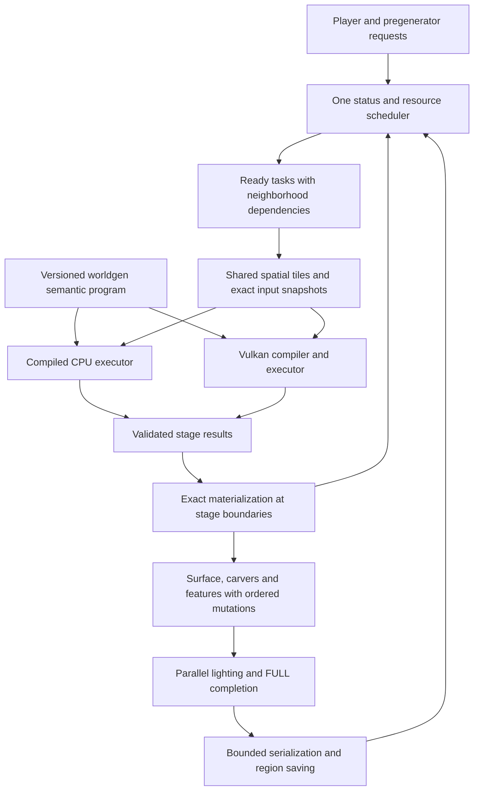

# WorldgenNext — a separate chunk-generation engine

> Historical design proposal. For the implemented v0.1 scope and validation, read ../../Plan.md and ../STATUS.md. Statements below describe the pre-implementation design assessment.

> The [v0.2 plan](../V0.2-PLAN.md) supersedes this proposal's milestone sequence and early C2ME scheduler adaptation. Functional integration now retains Minecraft's holder authority; optimization and any later scheduler replacement follow the complete baseline.

Design and performance assessment, 8 September 2026. Working name only.

This is a plan for a new mod. GPUWorldGen was examined as reference material; its source, configuration, and tests were not changed. No new mod has been implemented or benchmarked. The supporting [evidence ledger](EVIDENCE.md) distinguishes source findings, archived measurements, and external research. The [performance model](performance-model.json) contains illustrative assumptions, not measured new-mod results.

## Recommendation

Build a standalone engine that coordinates the entire chunk-generation pipeline, with a new compiler that evaluates shared spatial work once and produces exact sparse material results. Use a compiled CPU backend alongside headless Vulkan. Adapt a version-pinned, permissively licensed C2ME scheduler foundation, while writing the new GPU compiler and execution engine independently.

The central improvement is to reduce the amount of generation work and intermediate data. Changing graphics APIs alone has no demonstrated performance upside here. Keep Vulkan as the primary backend; compare an independently implemented OpenCL backend only through identical replay workloads. CUDA, CUDA-dependent SYCL backends, and CUDA runtime dependencies are excluded.

Use Minecraft 1.21.1 and NeoForge for the first integration so GPUWorldGen can be compared on the same loader and game version. Keep the semantic compiler and execution core independent of the loader. Add Fabric after the first matched comparison. New releases can target later Minecraft versions through separate adapters; current upstream 26.x code must not be assumed compatible with 1.21.1.

The default design preserves reference results, including ores, structures, lighting, metadata, and saved-world behavior in the supported matrix. Exact output is the design assumption: literal vanilla for vanilla worlds, and the original unaccelerated generator with the same pinned mods/datapacks for modded worlds. A different-terrain generator could be faster, but its throughput would be a separate product result.

The intended NOISE-completion targets on the RTX 5070 Ti class of host are **3,200–4,500 chunks/sec for vanilla** and **900–1,400 for Terralith + Tectonic**. Representative design points are 4,000 and 1,200: roughly 3× recent measurements and 2× the old mod's historical best. These are conditional engineering targets, not predictions or confidence intervals. They require substantial reductions in measured GPU service and CPU preparation costs, including the extra work needed for complete material correctness.

For fully generated and saved chunks, set an initial **1.5–2× end-to-end improvement objective** against a fresh matched baseline. There is not enough existing evidence to forecast an absolute FULL/saved cps value. Measure that baseline before accepting this objective as achievable.

## What the existing project teaches

GPUWorldGen already has considerable useful engineering: semantic interpolation boundaries, typed IR, staged column/lattice/block execution, shared aquifer roots and cells, asynchronous submission, compact vanilla palettes, mapped readback, transaction journals, and parallel ordered checksums. These are foundations to learn from, not new speedups to claim again.

Its production integration replaces `fillFromNoise`. Its benchmark requests `ChunkStatus.NOISE`, so the rate includes prerequisite work and completion of applied NOISE results. It does not require subsequent surface generation, carvers, features, lighting, FULL status, or durable saving. That limited scope leaves substantial opportunities for a new engine, but also makes a direct FULL-rate comparison invalid.

Archived matched radius-720 references are:

| Workload | Recent comparable measurements | Historical best | Approximate recent GPU bracket |
| --- | ---: | ---: | ---: |
| Vanilla | 1,332.71–1,429.51 cps | 2,007.83 cps | 0.515–0.523 ms/chunk |
| Terralith + Tectonic | 377.69–389.09 cps | 597.95 cps | 1.856 ms/chunk |

Radius 720 means **blocks**, producing a 91×91 square, or 8,281 measured chunks. The larger 42,849-chunk vanilla run reached 1,555.73 cps; it is useful scaling evidence but a different workload. September 8 radius-256 diagnostics are also a different shape. Do not cherry-pick either as a matched comparator.

The historical best is not a reproducible clean commit: it ran with uncommitted work. A new project must preserve exact source snapshots, binary hashes, generated shaders, settings, and raw timings. The observed change from approximately 0.250 to 0.515 ms/chunk is a real timing symptom; later experiments did not establish uniforms, guards, or push constants as its cause. The GPU bracket also includes barriers and gaps between dispatches.

Two correctness findings change the new design:

1. `ServerHarnessReport` writes a literal zero for the parity mismatch count. The cited normal-server runs disable independent full-state parity diagnostics. Their clean counters establish GPU service and structural validation, not comparison of every chunk against literal vanilla.
2. Current tests explicitly acknowledge missing ore-vein decoder logic; the inspected production compiler/classifier has no ore material path. Vanilla's NOISE material rules include an optional ore-vein rule after the aquifer rule. This is source-confirmed missing coverage, not a newly executed mismatch test. The new mod must implement and test that work before claiming exact Overworld output.

Therefore the old measurements are **exact-mode performance references with qualified correctness coverage**. The new mod's correctness work may initially make it slower. Every target below assumes this additional work fits within the stated service budgets.

## Product contract and success criteria

The product generates normal playable and saveable Minecraft chunks. It keeps standard world formats and loader-visible chunk semantics. The initial supported matrix is vanilla Overworld, Nether and End, then Terralith, Tectonic with Lithostitched, and their combination at pinned versions.

Define three distinct completion metrics:

- **NOISE committed:** prerequisite statuses are satisfied and all NOISE outputs are committed to the chunk. Record GPU execution, planned CPU execution and recovery separately.
- **FULL ready:** all required generation and lighting complete and the chunk is ready for its intended server use. Do not include network delivery in this counter.
- **Saved and verified:** the requested area finishes saving and reopens with correct state. Report logical save completion separately from an explicit flush/durability policy; do not call an OS write-cache enqueue durable storage.

For every supported matrix entry, a release candidate must preserve output and avoid a material throughput or p99 latency regression against its selected reference. Initial engineering goals are at least 1.5× matched FULL throughput, at least 30% lower p95 request-to-FULL latency under exploration, and no more than 5% regression on workloads that do not benefit. Treat these as acceptance objectives, not existing facts. Set final thresholds after the baseline captures reveal variance.

“Better in every way” cannot honestly mean faster on every seed, device, modpack and load while using less of every resource. Higher GPU occupancy can hurt rendering; wider concurrency can consume more memory. Provide measured policies for throughput, interactive latency, and efficiency, all using the same exact semantics. Evaluate improvement across supported workloads, correctness, startup, memory stability, platform coverage and observability rather than proclaiming universal dominance.

## Architecture



The diagram groups several stages for readability. It does not authorize reordering Minecraft's status prerequisites or exposing partially materialized state to mod hooks.

### 1. One scheduler for CPU work, GPU work and neighboring chunks

Use the C2ME/FlowSched lineage for scheduling primitives and threading fixes. Adapt a pinned base into this new mod rather than requiring the old GPUWorldGen jar. Maintain a small, reviewable upstream patch series. The new mod owns one chunk-system integration; it must detect incompatible second scheduler installations.

Tasks carry world epoch, context fingerprint, chunk/status, priority/deadline, cancellation, neighborhood dependencies, estimated CPU/GPU demand and reserved bytes. Holders and futures have one owner. A result commits once only if its epoch and status ownership still match.

Admission depends on memory and measured service demand, not just a fixed count of chunks. Reserve separate budgets for pending neighborhood work, CPU preparation, GPU scratch, readback and saving. Reserve CPU capacity for ticking, lighting and I/O; tune worker allocations across these pools together to avoid oversubscription.

Batch ready work with compatible contexts, preferring spatial locality when deadlines permit. Accept incomplete tiles and sparse requests immediately when waiting would hurt latency. A 4×4 or 8×8 tile is an internal computation unit, never a requirement that all corresponding Minecraft holders must exist before anything can run. Do not resurrect the rejected giant-ticket experiment.

For an urgent small request, compare predicted CPU finish time with GPU queue wait plus execution and materialization. Choose the quicker exact route. For pregeneration, fill the GPU while using spare CPU capacity for complementary work. CPU execution selected deliberately is a valid product path; it must not be mislabeled as GPU completion or exceptional recovery.

Preserve canonical neighborhood access and mutation ordering for structures, carvers and features. Known pure operations may execute freely; unknown mod hooks retain their supported original path and ordering. Do not blindly parallelize every feature or move random draws across branches.

### 2. A new semantic compiler with real control flow

Lower worldgen into a typed program with explicit control regions, interpolation/cache boundaries, random-state effects and execution domains. Domains include world constants, spatial columns, lattice samples, aquifer cells, blocks and material decisions. Domains are semantic metadata, not assumptions that all similarly named nodes are reusable.

The frontend covers final density, aquifer roots, ore-vein roots and material rules from the beginning. Later adapters add biome and surface programs. Custom node extensions must declare their inputs, purity, domain, bounds and CPU reference behavior; unrecognized nodes remain supported through a clearly reported CPU route where feasible.

Compile both a strict CPU evaluator and Vulkan kernels from the owned semantic representation. Preserve an independent literal-Minecraft oracle; a CPU and GPU compiler sharing the same frontend can agree on the same bug.

Implement genuinely branch-local lowering: compute a `RangeChoice` selector, then evaluate the branch-exclusive dependency subgraph only where needed. Shared prerequisites stay outside the branch. Use a simple branch, a coherent tile mask, or compacted worklists depending on measured divergence and branch cost. Worklist formation itself consumes bandwidth and dispatches, so it is not universally preferable. Current source's ternary over named temporaries suggests an opportunity, but actual generated code must verify that expensive work is currently executed unnecessarily.

Keep Java ordering, negative-coordinate floor behavior, signed zero, finite-precision effects and interpolation boundaries. Never turn `outer(interpolate(child))` into `interpolate(outer(child))`. Operations involving mutable caches or RNG effects require stronger treatment than ordinary pure common-subexpression elimination.

### 3. Shared spatial computation with lifetime-based storage

Assign reusable values canonical keys: semantic-node identity, world/registry epoch, seed and noise settings, coordinates, domain and execution mode. Include structure/blending fingerprints for any value that depends on them; otherwise isolate those inputs in chunk-owned dynamic tasks.

A region entry has an actual producer task and actual consumers. Coalesce simultaneous requests for identical samples, publish one completion, and retain the result only while its reuse justifies the bytes. The current generic region service appears unwired in production; the new design makes producer/consumer residency part of the execution graph itself. Existing aquifer caches and batch-local edge sharing are credited separately.

Start with bounded, demand-driven tiles and their exact halos. Batch-local deduplication is mandatory; cross-batch retention is earned by measured reuse. Fresh-world generation cannot reuse every output: this saves overlap between neighboring samples and stages, not the unique terrain of unvisited regions.

For perspective, a 4×4 block-cell lattice needs 5×5 horizontal corners per chunk. Sixteen independently sampled chunks need 400 corners per vertical level, while a contiguous 4×4-chunk tile needs 17×17 = 289: a 27.75% reduction in that particular lattice workload. Large contiguous regions approach a 36% reduction. The old mod already shares some edges, so even those values are not incremental whole-mod speedups.

Use structure-of-arrays storage with generated typed layouts. Store coordinates, offsets, IDs and provably integral distances in integer fields; retain double precision where the semantic contract needs it. Lifetime analysis aliases scratch ranges after their last consumer. Persistent halo/boundary values and ephemeral per-block temporaries have different lifetimes.

This replaces the current layout's sum of full-domain live-outs, which can require approximately 257.6 MB per execution slot for a 256-chunk combined workload. Set a prototype goal of halving peak intermediate bytes for that replay without increasing total GPU time. Measure success; the current arena size alone does not prove a bandwidth bottleneck.

### 4. Exact sparse materials and metadata

Make sparsity an output contract that avoids work throughout the pipeline. Use a section directory with representations such as uniform state, small-palette dense words and dense exceptional subtiles. Descriptors include context, section coordinates, representation, bounds, counts and checksums. Variable output uses bounded arenas with checked offsets; overflow rejects the uncommitted result and retries through a bounded dense or CPU route.

A uniform descriptor is allowed only if the **complete material result** is proven uniform. Positive density alone does not prove stone: ore-vein rules can produce ores, raw ore blocks or filler. Air proofs must account for aquifer/fluid choices, post-processing and any applicable structure/blending effect. Later surface rules may require densifying a formerly uniform section; that is normal and must be charged to the FULL result.

Use exact interval analysis around semantic operations and runtime tests of material prerequisites. Corner minima and maxima can bound an interpolation only with its actual arithmetic and the operations outside the boundary accounted for. If a proof is unavailable or ambiguous, evaluate the normal path. Begin with the simplest provable cases, then expand the proven subset.

For eligible uniform sections, avoid dense block classification, palette-word emission, metadata atomics, readback bytes and per-block decode. Produce exact counts and heightmap contributions analytically. Define a checksum over the canonical descriptor plus payload, and retain independent logical-state comparison for correctness. If preserving a logical expanded-sequence checksum, compose its uniform-run contribution algebraically rather than visiting every voxel. A checksum detects corruption; it is not proof of vanilla equivalence.

For mixed sections, give palette words and column metadata explicit owners. Use subgroup ballots/shuffles/reductions where supported, with a portable workgroup implementation. Probe subgroup features and widths; do not hardcode 32 lanes. Keep integer ordering for checksums and correct tails/inactive lanes.

The old uniform-air census of 66.05% is motivation for a prototype, not a promised 66% reduction in total time. Earlier skip experiments continued dense emission and metadata work and regressed. The new approach must demonstrate fewer executed operations and transferred bytes, not only a branch that returns air sooner.

### 5. GPU scheduling and compilation chosen by evidence

Use Vulkan with explicit queried FP64 and numerical controls, asynchronous timeline completion, persistent arenas and bounded dispatch duration. Start with a small number of kernels per semantic context, not a separate compiled pipeline for each batch size.

Choose stage fusion, workgroup shape and tile size using replay measurements. Record per-dispatch GPU timestamps, source/SPIR-V hashes, bytes touched, register/spill/occupancy information where the driver exposes it, and CPU feeding gaps. Keep a bounded set of variants and a cached winner per device/driver/context. Use offline or idle-time tuning, never lengthy tuning on a player's critical path.

The old planner already estimates liveness; the new contribution is to turn actual device costs and lifetime-reused storage into schedule selection. Direct SPIR-V generation is an optional later backend if GLSL obscures necessary control flow or precision. It is not a prerequisite for the first correct prototype.

Separate scratch leases from readback and Java materialization leases. Scratch can retire after its last GPU consumer; a slow result worker need not hold every resource from an execution slot. Preserve readback ownership until the last CPU reader finishes. Device loss invalidates the epoch and prevents stale writes; one controlled fallback or failure completes each request.

Provide rendering-aware GPU budgets for integrated play, using measured frame time and GPU pressure rather than assuming a compute queue is free hardware. Dedicated servers can spend more of the GPU on generation. Efficiency mode optimizes chunks per joule when power telemetry is available; otherwise report a limited utilization proxy rather than invented energy numbers.

### 6. CPU/GPU placement includes aquifers and exact CPU compilation

Compile repeated host router evaluation into batch evaluators rather than dispatching Java objects per sample. Share roots and sample coordinates where legal, and cache bounded primitive tile data. Begin with JVM bytecode generation; add native SIMD only if a replay demonstrates a useful gain after JNI and packaging costs. Calls must be batched, never JNI once per voxel.

Choose the aquifer placement per graph/device: compiled host status preparation, GPU status reduction, or the full GPU graph. The existing full-GPU route was not the fastest route on the inspected host. An ownership percentage is not an optimization objective.

Keep exact RNG sequences, candidate tie ordering and operation semantics across routes. CPU support remains useful for tiny requests, unsupported graphs, graphics contention, missing FP64 and recovery. It must be benchmarked as its own backend rather than compared using obsolete tiny CPU calibrations.

### 7. Extend beyond NOISE in measured stages

First accelerate biome climate sampling and selection, preserving exact tree/tie behavior and biome palettes. Then compile supported surface decision programs or use a compiled CPU path when serial column state makes GPU execution unattractive. Materialize state before hooks that require normal Minecraft objects.

Keep structures and arbitrary features on CPU initially, with scheduler concurrency that respects dependency radii and mutation conflicts. Optimize shared preparation, object layout and scheduling before attempting GPU feature placement. Only well-specified pure suboperations earn GPU kernels.

Use a version-matched ScalableLux module as the first lighting candidate and verify lighting outputs independently. Optimize serialization with pooled buffers, bounded compression tasks and region write coordination, while preserving the world format. Saving and chunk delivery must exert backpressure instead of allowing an ever-growing queue behind impressive generation cps.

Moonrise is the main alternative scheduler architecture. If an early matched FULL benchmark clearly favors it and its integration/license tradeoffs are acceptable, choose that lineage before expanding the engine. Never combine two competing chunk-system rewrites. This decision affects the host integration, not the owned semantic compiler.

## Graphics API and reuse decisions

| Choice | Decision | Basis |
| --- | --- | --- |
| Vulkan | Primary GPU backend | Existing working platform, explicit memory/synchronization, queried FP64 and subgroup support; no assured speedup from switching API |
| OpenCL | Independent replay prototype after the main compiler works | A different compiler may produce better kernels; require at least 25% replay-kernel and 15% end-to-end improvement to justify another supported backend |
| DirectCompute/D3D12 | Defer | Windows-specific; no measured hardware-throughput advantage; double support alone does not establish numerical equivalence |
| SYCL | Defer | Toolchain abstraction, not extra hardware capability; CUDA-dependent NVIDIA paths violate the requirement |
| Metal | CPU backend initially on Apple hardware | MSL does not support native `double`; software double emulation needs a separate feasibility result |
| Multiple GPUs | Later optional independent-tile execution | Adds routing and residency complexity; first saturate one GPU and the host pipeline |

Vulkan FP64 and `NoContraction` are not sufficient proof of Java equivalence. Query preservation/rounding capabilities, verify generated SPIR-V, and handle operations whose permitted accuracy differs from the reference through tested exact implementations or CPU execution. Sources: [Khronos numerical rules](https://docs.vulkan.org/spec/latest/appendices/spirvenv.html), [FP controls](https://docs.vulkan.org/refpages/latest/refpages/source/VkPhysicalDeviceFloatControlsProperties.html), [OpenCL C](https://registry.khronos.org/OpenCL/specs/unified/html/OpenCL_C.html), [Apple MSL specification](https://developer.apple.com/metal/Metal-Shading-Language-Specification.pdf#page=25).

Base C2ME is MIT with an explicit exclusion for its OpenCL module, which is ARR. FlowSched is MIT; Moonrise is GPLv3; ScalableLux is LGPLv3. Reuse only selected, license-audited files/modules with their notices. A permissive wrapper does not override a nested module's license. Keep separately licensed modules identifiable. Noisium's direct palette techniques overlap functionality already present here and earn no automatic extra multiplier. Version-pinned primary links and candidate backports are in [EVIDENCE.md](EVIDENCE.md).

## Performance case

### Targets relative to both baselines

These bands describe different levels of successful implementation. They are not probability distributions. A failed sparse/compiler prototype can produce no gain or a regression; there is no guaranteed positive lower bound.

| Milestone scenario | Vanilla NOISE cps | Versus recent 1,333 | Versus best 2,008 | Combined NOISE cps | Versus recent ~390 | Versus best 598 |
| --- | ---: | ---: | ---: | ---: | ---: | ---: |
| Initial successful prototype | 2,300–3,000 | 1.7–2.3× | 1.1–1.5× | 650–900 | 1.7–2.3× | 1.1–1.5× |
| Intended design | 3,200–4,500 | 2.4–3.4× | 1.6–2.2× | 900–1,400 | 2.3–3.6× | 1.5–2.3× |
| Research stretch | 5,000–6,500 | 3.8–4.9× | 2.5–3.2× | 1,600–2,200 | 4.1–5.6× | 2.7–3.7× |

Confidence in the architecture's identified bottlenecks is higher than confidence in any rate. The initial band has moderate technical plausibility conditional on the prototype succeeding; the intended band has low-to-moderate confidence; stretch has low confidence. No benchmark of the new architecture exists. Historical CPU/RAM provenance is incomplete, and a new matched baseline may change these ratios.

### Resource model and required reductions

For a sufficiently fed GPU-served NOISE pipeline, with every measured chunk passing through GPU generation and successful materialization, use:

`R_noise ≈ 1000 × utilization / max(prep_ms, gpu_ms, apply_ms, admission_ms)`

CPU values are effective milliseconds per completed chunk after accounting for the actual available worker count. GPU time is serial service per chunk over all relevant dispatches and dependencies. The maximum models overlap, not sequential latency. Queue waiting is not additional service demand. Account for CPU pools sharing the same cores; they cannot each claim the entire processor. These particular budgets do not model arbitrary heterogeneous routing: a CPU/GPU mix needs workload-weighted service demands for each route and one shared CPU-resource budget.

Representative assumed budgets from [performance-model.json](performance-model.json):

| Scenario | Prep effective ms | GPU ms | Apply effective ms | Admission effective ms | Utilization | Model cps |
| --- | ---: | ---: | ---: | ---: | ---: | ---: |
| Vanilla initial | 0.22 | 0.32 | 0.14 | 0.20 | 80% | 2,500 |
| Vanilla intended | 0.16 | 0.20 | 0.12 | 0.15 | 80% | 4,000 |
| Vanilla stretch | 0.11 | 0.14 | 0.09 | 0.10 | 84% | 6,000 |
| Combined initial | 0.85 | 1.067 | 0.22 | 0.25 | 80% | 750 |
| Combined intended | 0.52 | 0.667 | 0.17 | 0.20 | 80% | 1,200 |
| Combined stretch | 0.32 | 0.42 | 0.14 | 0.16 | 84% | 2,000 |

These are explicit budgets to test, not fitted measurements. All material work, including ores, and any extra copies/barriers must be counted within them.

The vanilla intended point requires reducing the recent 0.515-ms GPU bracket by about **61%**, while keeping preparation below 0.16 effective ms/chunk. At the old 0.250-ms bracket, the 4,000 target still requires about 20% less GPU service plus a better feed path. Returning to the old kernel alone does not achieve it.

The combined intended point requires reducing 1.856 ms to about 0.667 ms, about **64%**, and keeping effective host preparation below 0.52 ms. Historical combined GPU timing was already around 0.424 ms while observed cps remained 598: this is strong evidence that host/system work must improve too. Sparse final-output optimization alone is unlikely to deliver this combined target.

An unchanged vanilla GPU bracket has an idealized capacity around 1,940 cps, or around 1,550 at 80% useful duty. Scheduler-only work cannot plausibly provide the intended 4,000 on that same service demand.

Attribute gains to mechanisms once. Prototype sparse representation for vanilla; branch-aware execution, lifetime storage, region sharing and compiled host evaluation for complex packs. Do not multiply individual estimated speedups. API choice gets **zero assured gain** in the model.

### Fully generated and saved throughput

The existing evidence does not isolate the fraction of FULL elapsed time saved by a faster NOISE implementation. As a sensitivity example only, let `f` be the fraction of baseline time accelerated by factor `k`, with other work unchanged:

`full_speedup = 1 / (f/k + (1-f))`

| Accelerated fraction | 2× faster NOISE component | 3× faster NOISE component |
| --- | ---: | ---: |
| 30% | 1.18× | 1.25× |
| 50% | 1.33× | 1.50× |
| 70% | 1.54× | 1.88× |

This is a sensitivity calculation, not a measured stage fraction or a complete concurrent-pipeline simulation. CPU sample shares are not interchangeable with `f`. At the representative 50% fraction, improving the remaining work by 1.5× as well as NOISE by 3× yields 2× overall, illustrating why the whole pipeline is in scope. Actual throughput can become limited by feature dependencies, lighting, memory bandwidth, disk writes or client consumption.

Do not promise 10,000 exact fully generated chunks/sec on this host. No current evidence supports that claim. Any absolute FULL/saved target must follow the first matched measurements and include the actual storage device and durability policy.

### Optional research beyond the main target

A certified lower-precision filter could evaluate cheap bounds first and run the exact path for ambiguous material decisions. Its proof must enclose **the vanilla floating-point program's result**, not merely an ideal real-number formula. Coordinates, floor/permutation operations, branch boundaries, NaNs, aquifers and RNG decisions need explicit treatment. An epsilon chosen from a random sample is not a certificate.

Adaptive filtered predicates are a known research pattern, but applying them to Minecraft's program is new engineering, not a consequence of the geometric-predicate literature. See [Shewchuk's primary research](https://www.cs.cmu.edu/~quake/robust.html). Keep this disabled until a formal restricted subset and independent adversarial tests exist. The intended performance target does not rely on FP32 conversion, approximate noise, tensor hardware or different terrain.

## Implementation sequence and gates

Create a new repository when implementation begins. This design folder is not the new mod's source repository and does not import the old project as a build dependency.

Suggested module boundaries:

```text
worldgennext/
  semantic-core/       typed program, effects, domains, identities
  frontend-mc1211/     Minecraft adapters and extension contracts
  compiler-jvm/        exact compiled CPU programs
  compiler-vulkan/     control-flow lowering, layouts, shaders
  runtime-vulkan/      arenas, submission, completion, device policy
  spatial-data/        tile producers, halos, byte-bounded residency
  material-codec/      sparse descriptors, palettes, metadata, validation
  chunk-engine/        status DAG, reservations, scheduling, I/O
  neoforge-1211/       loader hooks and packaging
  fabric-1211/         later loader adapter
  oracle-and-replay/   independent comparison and captured workloads
  evidence/           immutable manifests, measurements and reports
```

| Phase | Deliverable | Decision gate |
| --- | --- | --- |
| 0 — Trustworthy comparison | Isolated old/new launch profiles; immutable source/binary snapshots; independent oracle; NOISE/FULL/saved instrumentation; version-matched upstream/license inventory | Raw wall-clock rates from explicitly warmed, compile-free intervals; real compared-chunk counts; ore-bearing non-flat Overworld fixtures; baseline repeat variance known |
| 1 — Small exact engine | Semantic core, CPU evaluator, Vulkan replay, ore/aquifer/material behavior, dense output first | Exact block/biome/metadata comparison across supported fixtures; failures/reloads/cancellation complete once; no live chunk changed before validation |
| 2 — Kill-or-continue prototypes | Sparse output with complete proofs; branch-local compilation; tiled/lifetime arena; compiled host aquifer | Measure service/bytes for each in isolation and together. Continue intended target only if vanilla approaches ≤0.25 ms/chunk and combined host/GPU measurements support a path to their budgets. Reject losing variants |
| 3 — New chunk engine | One scheduler lineage, resource reservations, CPU/GPU placement, real regional producers/consumers | Matched NOISE beats historical best beyond repeat variance; bounded memory over sustained virgin-world generation; exploration p95/p99 improves rather than merely average cps |
| 4 — Complete pipeline | Biome/surface acceleration where justified, ordered features, lighting module, bounded serialization/saving | FULL and reopened saved state match; measured end-to-end gain against fresh old-mod and CPU-optimized baselines; no hidden backlog at stop |
| 5 — Platform and release | AMD/Intel/NVIDIA Windows/Linux, integrated play, CPU-only behavior, Fabric adapter, supported modpack matrix | Public results identify exact hardware and scope; fault injection and long-run stability pass; unsupported features report explicit routes; all shipped licenses and notices verified |

Do not rebuild the whole chunk scheduler before testing whether the proposed compiler/material representation reduces actual GPU work. Phase 2 is the early economic decision: it can reject an attractive architecture before months of integration.

A rough planning scale is several months for one experienced developer to produce a qualified single-platform prototype and longer for a broadly supported replacement. The whole-pipeline and cross-platform work is much larger than a shader tuning pass. Prefer milestone gates over a promised calendar date; code reuse reduces concurrency work but does not remove its correctness burden.

## Benchmark and validation protocol

1. Freeze exact artifact identities: source snapshot including dirty changes, jars, JVM, loader, datapacks, driver, compiler, shaders, seed, coordinates, memory limits, scheduler policy and output endpoint. Preserve an untouched copy of the original project for reference. Do not claim the historical fast dirty tree has been reconstructed from its base commit alone.
2. Warm compilation/JIT using a separate area, wait until all required pipelines are ready, then begin the timer. Any compile during a nominal warm test invalidates that interval; do not subtract summed compile durations from elapsed time. Record cold startup separately.
3. Reuse the radius-720 NOISE shape for historical context, but use at least five paired runs in alternating/randomized order plus 60–120-second sustained fresh-area workloads for promotion. Report individual results, medians, spread and paired uncertainty; short 4-second best runs are anchors, not stable throughput guarantees.
4. Independently run NOISE, FULL and saved-area tests on vanilla, Terralith, Tectonic+Lithostitched and combined. Add Nether/End, high/custom world heights, distant positive/negative coordinates, region borders, ocean/lava, caves, blending/upgrades, structures and reloads. Separate demanding player requests from pure pregeneration.
5. Compare reference state for all selected correctness-corpus chunks: blocks including ore/filler, biome palettes, heightmaps, section counts, light arrays at LIGHT/FULL, post-processing, fluid ticks, structures and relevant persisted metadata. Use literal vanilla for vanilla fixtures; for modded fixtures use the original unaccelerated generator with the same pinned mods, datapacks, settings and hooks. Canonicalize only documented nonsemantic serialization details; never hide a meaningful RNG/order difference. Record compared count and mismatch count from the comparator.
6. Keep correctness campaigns and performance campaigns separate but tied to the same artifact. In performance runs, retain transport/identity/bounds validation. State whether independent parity was sampled or absent. Report `gpuCompleted`, `gpuCommitted`, `cpuPlanned`, `cpuCommitted`, `cpuRecovery`, unsupported reasons and comparison coverage separately. The throughput numerator counts unique successfully NOISE-committed requests, never planned work or merely completed dispatches; record the final committing route to prevent double counting. Require zero recovery/failure for strict GPU arms; permit honestly counted planned CPU work in heterogeneous product arms.
7. Profile every dispatch and stage plus CPU busy time, queue wait, batch shapes, bytes uploaded/read, allocations, retained caches, GPU duty and p95/p99 latency. Measure long-run memory growth and rendering interference. Isolate profiling overhead with an unprofiled control.
8. Add CPU-only vanilla, pinned C2ME, and a separate Moonrise configuration as end-to-end competitors. Do not stack incompatible schedulers. Benchmark permitted C2ME OpenCL binaries as a separate black-box competitor only if appropriate; do not copy its code or transfer its advertised gains into this estimate.
9. Test device loss, allocation failure, cancelled futures, unload/reload, shutdown while busy, partial final batches and late completions. Test failed save/restart recovery under the declared persistence policy. Do not advertise reliability from throughput counters alone.

## Final design decision

Pursue a separate full-pipeline engine with exact material semantics, demand-driven spatial reuse, a control-flow-aware compiler, sparse output and adaptive CPU/GPU placement. Keep Vulkan until measurements justify another backend. The most useful initial bet is the Phase 2 representation/compiler prototype; it directly tests whether ~2× historical-best NOISE throughput is attainable while implementing complete NOISE material semantics. FULL and saved throughput remain separate objectives.
